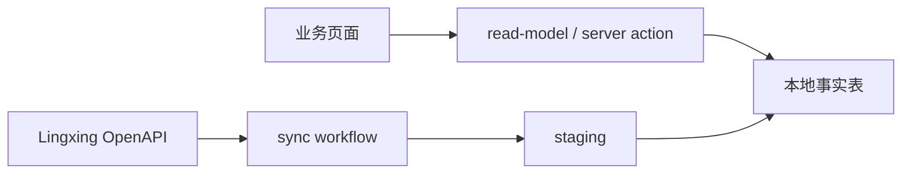

# 同步字段来源对照（polabel2 适配版）

> 2026-05-23 · 基于老项目 `operations-log-field-source-map.md` 适配 polabel2 数据模型
> 2026-05-30 · 修正运营日志 Spotter/领星字段边界，收紧 VC traffic 当前态
> 核心变更：老项目 `fba_links_dataset_cache` 拆分为 `sales_trend_daily` + `product_performance_daily`

---

## 结论

polabel2 的业务页面（VC 链接、FBA 链接、运营日志、产品总览）全部只读本地事实表，不在页面展开时实时请求领星。数据由 sync-engine 的各 workflow 异步写入。运营日志不是“Spotter 竞品/诊断”页面：`operations_tracking.source='spotterio'` 的销量、销售额、访问量归 Spotter 来源；大类/小类、评价数、评分等 performance 字段归领星 `sync:sc-performance`。当前项目没有“Spotter 竞品/诊断 facts”这类数据合同。

领星接口必须先分 lane：

- **OpenAPI lane**: `https://openapi.lingxing.com`，使用 `app_key + app_secret + access_token + sign`。截图中 VC 菜单的 `basicOpen/...`、`basicOpen/vc/report/...`、`basicOpen/openapi/getInvoice/...` 都属于这一类。
- **ERP Report lane**: `https://gw.lingxingerp.com`，已废弃（ADR-0021）。旧文档里的 `/vc/report/vcSalesStatics/list` 属于旧 ERP 报表线索，不再作为新 VC 报表主口径。
- **写操作**: 确认发货、请求标签、批量配对等必须单独 slice，不允许因为字段来源表登记就直接接入生产写路径。
- **文档访问口令**: 只用于查看官方文档，不能写入仓库，也不能当运行时凭证。

### Lingxing API Contract Checklist

| Required term | 当前合同 |
|---|---|
| Lane | OpenAPI lane 负责所有 VC 报表和业务接口。ERP Report lane 已废弃（ADR-0021），旧 `/vc/report/...` 仅作历史线索。 |
| Credentials | OpenAPI 使用 `<LINGXING_APP_KEY>`、`<LINGXING_APP_SECRET>`、`<LINGXING_ACCESS_TOKEN>` 与签名。ERP Report 凭证（`<LINGXING_ERP_AUTH_TOKEN>`、`<LINGXING_COMPANY_ID>`）已废弃（ADR-0021），本文件不保存真实值。 |
| Endpoints | VC 菜单接口集中登记在“领星 VC 菜单接口补充”表，新增接口必须先登记路径、请求字段、返回字段和落点。 |
| Field Mapping | 字段只落到本文件明确列出的事实表或待建表；未登记字段不得在页面伪造。 |
| Validation | 新接入任何 VC 只读接口前，先做最小 read-only smoke test；写接口必须单独 slice 验证权限、审计和失败回滚。 |
| Failure Modes | 发现字段样例不足、0 行无 evidence、写操作无审计时，必须停止接入。 |
| Open Decisions | PO/DF 写操作的权限/审计/幂等设计；VC 发货单 facts 表设计见 `po-df-openapi-field-map.md`。 |

### 字段命名合同（2026-05-30）

> 本节写 Lingxing 官方字段与 polabel2 当前宪法/schema 字段。宪法层已将产品主档字段定义为 `products.sku`，将销售链接字段定义为 `product_channels.listing_sku`，事实表字段定义为 `listing_sku`。

| 业务对象 | Lingxing 官方字段 | 官方含义 | 当前代码/schema 字段 | polabel2 宪法目标字段 | 页面展示名 | 规则 |
|---|---|---|---|---|---|---|
| 产品主档 | `sku` | 领星产品管理 SKU，本地产品中心键 | `products.sku` | `products.sku` | MSKU / SKU | 字段名跟随领星官方 `sku`；这是产品主档身份，不等于 Listing SKU |
| 产品主档 | `sku_identifier` | 领星产品标识码 | 当前未作为产品中心键 | 如需落库另设 `sku_identifier` | SKU 标识 | 不能替代 `products.sku` 做中心键 |
| 产品主档 | `product_name` | 领星产品名称 | `products.product_name` | `products.product_name` | 产品名称 | 字段严格跟随 Lingxing 官方名；不由手工维护区覆盖同步真相 |
| 产品主档 | `brand_name` | 品牌 | `products.brand_name` | `products.brand_name` | Brand | 字段严格跟随 Lingxing 官方名 |
| 产品主档 | `category_name` | 类目 | `products.category_name` | `products.category_name` | Category | 字段严格跟随 Lingxing 官方名；不得和手工市场目录混淆 |
| 产品主档 | `cg_price` | 采购价 | `products.cg_price` | `products.cg_price` | 采购价 | 字段严格跟随 Lingxing 官方名；不等同本地财务成本 |
| 产品主档 | `pic_url` | 产品图 | `products.image_url` | `products.image_url` | 图片 | sync:products 写入 |
| 产品主档 | `update_time` / 响应更新时间 | 上游产品更新时间 | 当前常用 `products.updated_at` 被误用为页面“最后同步” | 新增 `products.product_main_sync_attempted_at`，如需上游更新时间另设字段 | 最后同步 | 不得用 `updated_at` 判断是否跑过产品主数据同步 |
| SC Listing | `seller_sku` | Seller Central 店铺/Listing SKU | `product_channels.listing_sku` | `product_channels.listing_sku` | MSKU | `listing_sku` 是本地统一字段名；SC 来源字段为 `seller_sku` |
| SC Listing | `local_sku` | 已配对的领星本地产品 SKU | 用于匹配 `products.sku` | 用于匹配 `products.sku` | 本地 SKU | 只作匹配键，不作为 product_channels 的销售链接 SKU |
| VC Listing | `msku` | Vendor Central 店铺 model number | — | — | MSKU/model number | 只作诊断/原始证据；不是配对键，不写 `product_channels.listing_sku`，为空不得阻断 ASIN 投影 |
| VC Listing | `local_sku` | 已配对的领星本地产品 SKU | 用于匹配 `products.sku` | 用于匹配 `products.sku` | 本地 SKU | 为空或无法匹配时不得创建 product_channels，不得 ASIN-only 配对 |
| 销量/广告/库存 facts | `seller_sku` / `msku` / `sku` | 上游报表中的 Listing SKU 或库存 SKU | `listing_sku` | `listing_sku` | MSKU | 事实表字段统一为 `listing_sku`；页面文案可继续显示 MSKU |
| 店铺 | SC `sid` | Seller Central 店铺 ID / 报表请求参数 | `channels.store_id` | `channels.store_id` | 店铺 ID | 仅 SC 语义，不和 VC report `sid` 混用 |
| 店铺 | VC `vc_store_id`；VC report 参数名 `sid` | Vendor Central 店铺 ID / VC report 请求参数 | `channels.store_id` | `channels.store_id` | 店铺 ID | VC report 的 `sid` 值来自 `vc_store_id`；不是广告 `profile_id` |
| 广告账号 | `profile_id` | 广告报表账号 ID | 当前按 workflow/账号探针使用 | 保持 `profile_id` | 广告账号 | VC ads 必须用 `profile_id`，不得用 `vc_store_id` 或 SC `sid` 代替 |

#### 产品页同步触发合同（目标态）

| 入口 | 目标行为 | 产品主数据策略 | 配对/渠道策略 | 禁止事项 |
|---|---|---|---|---|
| 产品弹窗“点击同步” | 只为当前产品触发同步，页面停留在 `/products` | 每次跑当前 `sku` 的产品主数据；优先用 `/erp/sc/routing/data/local_inventory/productInfo` by `sku`，或 `productList.sku_list` | SC 可用 `/erp/sc/data/mws/listing` 的 `search_field=sku/seller_sku` 缩小范围；VC Listing 当前官方截图参数仅 `offset/length/vc_store_ids`，未提供 SKU/MSKU/ASIN 过滤，不得声称单 SKU VC pairing 更省 | 不跳转同步中心；不在页面直接写 products/product_channels；不 silent fallback |
| 产品页顶部“点击同步” | 触发产品页全局同步并轮询 sync_runs | 只给 `product_main_sync_attempted_at IS NULL` 的本地产品跑首次产品主数据；已尝试但仍缺图/品牌/类目的产品不因全局按钮反复跑 | 再触发 pairing；SC 可按支持的筛选收敛，VC Listing 保持全局或明确显示全局范围，除非后续找到新的官方过滤参数 | 不用 `products.updated_at` 判断是否同步过；不为迁就个别缺图产品每次全量 products |
| 同步中心 | 管理员观察/调度/排错入口 | 按 sync type 合同执行 | 按 sync type 合同执行 | 普通业务页面不要求用户理解同步中心细节 |

---

## 0. 当前页面字段总图（2026-05-29）

### 0.1 全局 ID 与运行边界

| 主题 | 当前合同 | 禁止事项 |
|---|---|---|
| VC 店铺主键 | `channels.store_id = /basicOpen/platformAuth/vcSeller/pageList` 返回的 `vc_store_id` | 不用 VC `seller_id`、`account_id`、广告 `profile_id` 替代 |
| VC report 请求参数 `sid` | 参数名叫 `sid`，值来自 `channels.store_id`（即 `vc_store_id`） | 不把它和 SC `sid` 混成同一业务口径 |
| VC sales / realtime 的 `store_id` | 官方响应行不返回 `sid`，必须从请求上下文写入本地 `store_id` | 不从 response row 读 `sid/store_id/vc_store_id` |
| VC traffic / inventory / nppm 的 `store_id` | 官方响应行返回 `sid`，仍需校验它和请求 `sid` 一致 | 不接受和请求店铺不一致的响应行 |
| 本地事实粒度 | 当前代码事实表至少包含 `data_source_id + store_id + channel_type + asin + listing_sku + 时间粒度` | 不按 ASIN-only 合并 SC；不漏 `channel_type` |
| 页面取数 | 业务页面只读本地事实表/read-model；领星只由 sync workflow 异步拉取 | 页面打开时不直连领星 |
| ERP Report | `/vc/report/...` 已废弃，仅作历史线索 | 不作为 fallback，不再要求 ERP token |



字段链路只允许按这个方向解释：

1. 页面字段读取 `read-model / server action` 输出，不读取 staging/raw payload。
2. read-model 只聚合 canonical 表；接口字段必须先进入对应 workflow，再经 staging/promote 写入 canonical。
3. 下方标记为“目标态/待实现/待验证”的字段可以指导后续实现，但不能被当前页面假造。
4. 同一业务事实可以由不同上游接口写入同一 canonical 表，例如 SC/VC 销量同归 `sales_trend_daily`，SC/VC 库存同归 `inventory_daily`；不同业务事实不得互相覆盖。

### 0.1.1 当前配置测试探针与真实同步验证边界

配置页“测试连接”只证明 OpenAPI token 获取成功，并且当次连接测试包含的最小只读探针没有失败；它不是所有业务 workflow 的真实同步验收。绿色圆点不得解释为 VC sales、VC ads、PO/DF、invoice、Spotter facts 等全量同步均已跑通。

当前连接测试探针合同如下：

| 探针 | 最小接口 | 证明范围 | 不证明 |
|---|---|---|---|
| `sync:stores` | `/basicOpen/platformAuth/vcSeller/pageList` + `/erp/sc/data/seller/lists` | VC/SC 店铺目录接口可访问 | 店铺目录已完整落库或所有店铺可同步 |
| `sync:pairing` | `/erp/sc/data/mws/listing` + `/basicOpen/listingManage/vcListing/pageList` | SC/VC Listing 只读接口可访问 | product_channels 已完整派生 |
| `sync:sc-sales` | `/erp/sc/data/sales_report/asinDailyLists` | SC 销量接口最小请求可访问 | 全日期窗口同步成功 |
| `sync:sc-performance` | `/bd/productPerformance/openApi/asinList` | SC 产品表现接口最小请求可访问 | VC traffic 或 VC 广告可用 |
| `sync:sc-inventory` | `/erp/sc/routing/fba/fbaStock/fbaList` | SC FBA 当前库存快照接口可访问 | 历史库存可回填 |
| `sync:sc-ads` | `account/list type=seller` + `/pb/openapi/newad/spProductAdReports` | SC 广告账号/报表最小链路可访问 | VC 广告可用 |
| `sync:vc-inventory` | `/basicOpen/vc/report/inventory/list` | VC 库存报表最小请求可访问 | schema/migration 已在当前库执行 |
| `sync:vc-sales` | `/basicOpen/vc/report/sales/list` | VC 销量报表最小请求可访问 | 业务日期窗口同步成功 |
| `sync:vc-traffic` | `/basicOpen/vc/report/traffic/list` | VC 浏览量接口最小请求可访问；2026-06-26 已用真实 OpenAPI run 验收运营日志页面消费 | 不证明桌/移拆分字段已由官方返回 |
| `sync:vc-ads` | `account/list type=vendor` + `/pb/openapi/newad/spProductAdReports` | 必须用 `profile_id`；2026-06-26 已用真实 OpenAPI run 验收运营日志页面消费 | 不得用 `vc_store_id` 或 `sync:sc-ads` 代替；不证明 SB/SD/HSA 全组合均已有样本 |

`verify-real-sync` 是 CLI 真实同步抽样验证脚本，不是配置页连接测试探针。当前合同只用于按固定样本跑真实 workflow 并输出 evidence，不能拿它的成功/失败替代配置页“测试连接”结论，也不能把它没覆盖的 workflow 说成已验证。

### 0.2 页面总览

| 页面 | 页面需要的字段组 | 本地读取表 / read-model 输入 | 同步 workflow | 上游接口 |
|---|---|---|---|---|
| `/admin/settings/integrations` 数据配置 | 连接名称、账号类型、OpenAPI 凭证状态、token 刷新状态、店铺目录摘要 | `data_sources`, `lingxing_credentials`, `channels` | `sync:stores` / 连接测试 | OpenAPI token 接口；`/basicOpen/platformAuth/vcSeller/pageList`；`/erp/sc/data/seller/lists` |
| `/admin/sync` 同步中心 | 店铺、类型、时间窗口、状态、失败原因、segment evidence、覆盖率 | `sync_runs`, `sync_run_segments`, `sync_schedules`, `channels`, 各事实表覆盖查询 | 所有 `sync:*` | 不直连上游；只触发/观察 workflow |
| `/sales/vc-links` 印度 VC 链接 | VC 店铺、ASIN/MSKU、父 ASIN、销量、销售额、退货、订单量、浏览量、转化率、库存、排名/评价/评分、广告指标 | `channels`, `product_channels`, `sales_trend_daily`, `vc_traffic_daily`, `inventory_daily`, `product_performance_daily`, `sales_trend_ad_daily` | `sync:stores`, `sync:pairing`, `sync:vc-sales`, `sync:vc-traffic`, `sync:vc-inventory`, `sync:sc-performance`, `sync:vc-ads`（`sync:vc-traffic`/`sync:vc-ads` 已完成真实 OpenAPI run 与运营日志页面消费验收；`/sales/vc-links` 页面消费另按该页验收） | VC Seller / Listing / VC sales / traffic / inventory / product performance / ads；VC ads 必须走 `profile_id` |
| `/sales/fba-links` FBA 链接 | SC 店铺、ASIN/MSKU、销量、销售额、广告、FBA 可售/在途/预留/不可售、排名/评价/评分 | `channels`, `product_channels`, `sales_trend_daily`, `sales_trend_ad_daily`, `inventory_daily`, `product_performance_daily` | `sync:stores`, `sync:pairing`, `sync:sc-sales`, `sync:sc-ads`, `sync:sc-inventory`, `sync:sc-performance` | SC seller/listing/sales/ad/FBA stock/product performance；`sync:sc-inventory` 是当前快照，不支持历史回填 |
| `/sales/overview` 产品总览（当前路由跳转 `/products/overview`） | 产品、渠道汇总销量/销售额、VC/FBA 拆分、库存、评分、趋势 | `products`, `product_channels`, `sales_trend_daily`, `inventory_daily`, `product_performance_daily` | 不直接同步；依赖各事实 workflow | 无页面直连接口 |
| `/operations/log` 运营日志 | 跟踪 ASIN、店铺/MSKU、日销量/销售额/广告/库存/访问量、performance、备注 | `operations_tracking`, `operations_history`, `products`, `product_channels`, `sales_trend_daily`, `sales_trend_ad_daily`, `inventory_daily`, `product_performance_daily`, `vc_traffic_daily`, `sales_trend_action_notes` | 依赖同步中心领星事实 workflow；Spotter facts workflow 当前未建；2026-06-26 已验收 VC traffic / VC ads 真实 OpenAPI run 后页面消费 | Spotter 来源只覆盖销量/销售额/访问量；领星覆盖店铺/MSKU、广告/库存、performance；VC 访问量来自 `vc_traffic_daily`；本地覆盖跟踪池和备注；无 Spotter 竞品/诊断 facts |
| PO / DF / 发货单页面 | 当前 PO 页面读写本地 `purchase_orders`；DF 页面读写本地 `df_orders`；OpenAPI facts 已有目标表/workflow 但未成为页面主数据源 | 当前页面：`purchase_orders`, `df_orders`；OpenAPI facts：`vc_order_headers/lines`, `vc_purchase_order_headers/lines`, `vc_df_order_headers/lines`, `vc_df_label_tasks`, `vc_invoice_headers/lines` | 当前页面：本地 CRUD/导入；OpenAPI facts：`sync:po-orders`, `sync:df-orders`, `sync:vc-invoices` | 当前页面未由 API facts 驱动；目标接口为 `/basicOpen/platformOrder/vcOrder*`, `/basicOpen/openapi/getInvoice/*` |

### 0.3 `/sales/vc-links` 页面字段明细

| 页面字段 | 本地字段 / 计算 | 本地表 | workflow | 上游接口 | 上游字段 | 关键规则 |
|---|---|---|---|---|---|---|
| 店铺名 | `channels.store_name` | `channels` | `sync:stores` | `/basicOpen/platformAuth/vcSeller/pageList` | `name` | `store_id = vc_store_id` |
| 店铺 ID | `channels.store_id` | `channels` | `sync:stores` | 同上 | `vc_store_id` | VC report 请求参数 `sid` 取这个值 |
| 国家/站点 | `channels.country` | `channels` | `sync:stores` | 同上 | `region` / `region_name` | 只用于展示/筛选 |
| ASIN | `product_channels.asin` / fact `asin` | `product_channels` + facts | `sync:pairing` | `/basicOpen/listingManage/vcListing/pageList` | `asin` | fact 可先 ASIN-only 落库；`product_channels` 只能在 `local_sku` 匹配本地 `products.sku` 后创建，不得 ASIN-only 配对 |
| MSKU / model number | VC 诊断字段；facts 按 `listing_sku` 合同处理 | `product_channels` + facts | `sync:pairing` | 同上 | `msku` / `local_sku` | `local_sku` 与 SC Listing `local_sku` 同语义，用于匹配本地产品 SKU；VC `msku` 是店铺 model number，不写入 `product_channels.listing_sku` |
| 父 ASIN | `product_channels.parent_asin` | `product_channels` | `sync:pairing` | 同上 | `parent_asin` | 由 sync:pairing 从 VC Listing 写入 product_channels；不作为事实表唯一键 |
| 商品标题 | `product_channels.item_name` | `product_channels` | `sync:pairing` | 同上 | `item_name` | 由 sync:pairing 从 VC Listing 写入；不从 sales fact 伪造 |
| 商品图片 | `product_channels.image_url` | `product_channels` | `sync:pairing` | 同上 | `small_min_image_url` | 由 sync:pairing 从 VC Listing 写入 |
| 日销量 | `quantity` | `sales_trend_daily` | `sync:vc-sales` | `/basicOpen/vc/report/sales/list` (`view=manufacturing`) | `shippedUnits` | `store_id` 从请求 `sid` 写入；日维主口径 |
| 日销售额 | `revenue`, `currency` | `sales_trend_daily` | `sync:vc-sales` | 同上 | `shippedRevenueAmount`, `shippedRevenueCurrencyCode` | 日维主口径 |
| 退货量 | `returns_qty` | `sales_trend_daily` | `sync:vc-sales` | 同上 | `customerReturns` | 日维 |
| 订单口径 | — | — | `sync:vc-sales` | 同上 | `orderedUnits`, `orderedRevenueAmount`, `orderedRevenueCurrencyCode` | 不写入任何 VC 日维 canonical 字段；需要展示时另建字段/迁移 |
| 浏览量 | `glance_views` | `vc_traffic_daily` | `sync:vc-traffic` | `/basicOpen/vc/report/traffic/list` | `glanceViews` | 响应含 `sid`，需与请求 `sid` 一致 |
| 桌面端浏览/会话（预留） | `session_vc_desktop` | `vc_traffic_daily` | 待确认 | `/basicOpen/vc/report/traffic/list` 或后续确认的 VC traffic 接口 | 待确认 | 用户提供的官方响应样例未返回该字段；本地自拟预留字段名与 nullable 预留列已固定，当前写 `NULL`。后续官方字段确认后直接映射到该字段。无数据时展示 `--(桌)/--(移)`；不得从 `glance_views` 或 SC performance 拆分兜底 |
| 移动端浏览/会话（预留） | `session_vc_mobile` | `vc_traffic_daily` | 待确认 | `/basicOpen/vc/report/traffic/list` 或后续确认的 VC traffic 接口 | 待确认 | 用户提供的官方响应样例未返回该字段；本地自拟预留字段名与 nullable 预留列已固定，当前写 `NULL`。后续官方字段确认后直接映射到该字段。无数据时展示 `--(桌)/--(移)`；不得从 `glance_views` 或 SC performance 拆分兜底 |
| 转化率 | `quantity / glance_views` | `sales_trend_daily` + `vc_traffic_daily` | 派生查询 | 同上 | — | 查询时计算，不落库 |
| 可售库存 | `sellable` | `inventory_daily` | `sync:vc-inventory` | `/basicOpen/vc/report/inventory/list` | `sellableOnHandInventoryUnits` | VC `reserved=0` |
| 不可售库存 | `unfulfillable` | `inventory_daily` | `sync:vc-inventory` | 同上 | `unsellableOnHandInventoryUnits` | 日维库存报表 |
| 不良库存 | `unhealthy_units` | `inventory_daily` | `sync:vc-inventory` | 同上 | `unhealthyInventoryUnits` | VC 扩展列 |
| 90天以上可售 | `aged90_sellable_units` | `inventory_daily` | `sync:vc-inventory` | 同上 | `aged90PlusDaysSellableInventoryUnits` | VC 扩展列 |
| 净收货库存 | `inbound` | `inventory_daily` | `sync:vc-inventory` | 同上 | `netReceivedInventoryUnits` | VC inbound 口径 |
| 售罄率/收货满足率/供应商确认率 | `sell_through_rate`, `receive_fill_rate`, `vendor_confirmation_rate` | `inventory_daily` | `sync:vc-inventory` | 同上 | `sellThroughRate`, `receiveFillRate`, `vendorConfirmationRate` | 率类字段仅 VC 有值 |
| 排名/评价/评分 | `cate_rank`, `small_cate_rank`, `review_count`, `rating` | `product_performance_daily` | `sync:sc-performance` | `/bd/productPerformance/openApi/asinList` | ranking/review/star 类字段 | **唯一写入来源**：只有 `sync:sc-performance` 写 product_performance_daily。VC Listing 的排名/评价/星级只作为 product_channels 展示字段（parent_asin/item_name/image_url），不写入 product_performance_daily |
| 广告花费/订单/点击/曝光 | `spend`, `ad_orders`, `clicks`, `impressions` | `sales_trend_ad_daily` | `sync:vc-ads`（2026-06-26 已验收真实 OpenAPI run 与运营日志页面消费） | `account/list type=vendor` → `/pb/openapi/newad/*ProductAdReports` | `profile_id`, `cost`, `orders`, `clicks`, `impressions` | 必须先用 `account/list type=vendor` 取 `profile_id`，再用 `profile_id` 请求 SP/SB/SD 报表；`vc_store_id` 不能替代 `profile_id`，也不能复用 `sync:sc-ads` |

### 0.4 `/sales/fba-links` 页面字段明细

| 页面字段 | 本地字段 / 计算 | 本地表 | workflow | 上游接口 | 上游字段 | 关键规则 |
|---|---|---|---|---|---|---|
| 店铺名/国家 | `store_name`, `country` | `channels` | `sync:stores` | `/erp/sc/data/seller/lists` | `name`, `region` | SC `store_id = sid` |
| 通道 | `channel_type` | `channels` | `sync:pairing` | `/erp/sc/data/mws/listing` | `fulfillment_channel_type` | FBA→`sc_fba`，FBM→`sc_fbm` |
| ASIN/MSKU | `asin`, `listing_sku` | `product_channels` | `sync:pairing` | `/erp/sc/data/mws/listing` | `asin`, `seller_sku`, `local_sku` | SC 官方 Listing SKU 为 `seller_sku`，写入 `product_channels.listing_sku`；`local_sku` 只用于匹配产品 SKU；SC 不允许 ASIN-only 兜底 |
| 日销量 | `quantity` | `sales_trend_daily` | `sync:sc-sales` | `/erp/sc/data/sales_report/asinDailyLists` | `type=2` 的 `map_value` | 需按 `sid + channel_type + asin` 解析 MSKU |
| 日销售额 | `revenue`, `currency` | `sales_trend_daily` | `sync:sc-sales` | 同上 | `type=1` 的 `map_value`, `currency_code` | 保留 MSKU 粒度 |
| 退货/库存快照/评分/评论 | `returns_qty`, `inventory`, `rating`, `reviews_count` | `sales_trend_daily` | 非 sync:sc-sales 写入 | SC 退货报表（待接入）/ FBA stock / product performance | — | **注意**：官方 asinDailyLists 不返回这些字段。SC 场景下由对应独立 workflow 写入，不由 sync:sc-sales 写入 |
| 广告花费/销售额/订单/点击/曝光 | `spend`, `ad_sales`, `ad_orders`, `clicks`, `impressions` | `sales_trend_ad_daily` | `sync:sc-ads` | `/pb/openapi/newad/spProductAdReports`, `listHsaProductAdReport`, `sdProductAdReports` | `cost`, `sales`, `orders`, `clicks`, `impressions` | campaign_type 区分 SP/SB/SD |
| FBA 可售 | `sellable` | `inventory_daily` | `sync:sc-inventory` | `/erp/sc/routing/fba/fbaStock/fbaList` | `afn_fulfillable_quantity` | 当前快照；`business_date` 由同步日期决定，不接受历史日期回填 |
| FBA 在途/预留/不可售 | `inbound`, `reserved`, `unfulfillable` | `inventory_daily` | `sync:sc-inventory` | 同上 | `reserved_fc_transfers`, `reserved_fc_processing`, `afn_unsellable_quantity` | `channel_type='sc_fba'`；覆盖矩阵只能按快照覆盖解释 |
| FBM 库存 | — | — | — | — | — | 当前不接入 FBM 库存事实，页面保持空值/`-`；不得把领星 `modifyFbmInventory` 写回接口或本地/海外仓库存报表伪装成 Amazon FBM Listing 库存 |
| 排名/评价/评分 | `cate_rank`, `small_cate_rank`, `review_count`, `rating` | `product_performance_daily` | `sync:sc-performance` | `/bd/productPerformance/openApi/asinList` | rank/review 类字段 | 当前 workflow 只写 control-plane `snapshotDate` 归属的快照字段；当前快照不能修复历史 gap。`sessions_total/sessions/sessions_mobile` 保留为 daily access 列，但响应无逐行日期时必须 fail loud 且不写 |

### 0.5 `/sales/overview` 与 `/operations/log`

| 页面 | 页面字段 | 本地来源 | 上游来源 | 关键规则 |
|---|---|---|---|---|
| 产品总览（`/sales/overview` → `/products/overview`） | 产品名称、MSKU/SKU、图片、成本/MRP | `products` | 产品管理 `/erp/sc/routing/data/local_inventory/productList` / 单品优先 `/erp/sc/routing/data/local_inventory/productInfo` | 产品主档以本地 `products.sku` 为中心，不镜像全量领星产品；产品主数据同步尝试时间用 `product_main_sync_attempted_at`，不能用 `updated_at` |
| 产品总览 | VC/FBA/FBM 销量与销售额 | `sales_trend_daily` 聚合 | `sync:vc-sales`, `sync:sc-sales` | 聚合必须保留 `channel_type` 后再汇总 |
| 产品总览 | 库存 | `inventory_daily` 聚合 | `sync:vc-inventory`, `sync:sc-inventory` | VC 与 SC 库存口径分开展示或明确汇总公式 |
| 产品总览 | 评分/评价/排名 | `product_performance_daily` 最新日 | `sync:sc-performance` | 不是 sales report 字段 |
| 运营日志 | 跟踪 ASIN/MSKU/店铺 | `operations_tracking` + `product_channels` | 同步中心事实表 | 手动 ASIN 必须优先对齐同步中心已有配对/事实 |
| 运营日志（Spotter 来源） | 日维销量、销售额、访问量 | `operations_history`（当前承载表）/ 目标态 Spotter facts 表（待建） | Spotter API（待明确 endpoint + workflow） | 只允许写 `source='spotterio'` 明确字段；不得扩展成竞品/诊断数据 |
| 运营日志（领星来源） | 广告、库存、SC 销量/销售额、VC 销量/销售额 | `sales_trend_daily`, `sales_trend_ad_daily`, `inventory_daily` | 对应 sync workflow | 页面只读本地事实，缺失显示同步中心暂无数据 |
| 运营日志（领星 performance） | 大类、小类、评价数、评分、促销当前快照；SC daily access 当前缺事实 | `product_performance_daily` | `sync:sc-performance` | 当前只写 control-plane `snapshotDate` 归属的快照字段；daily sessions 缺真实响应日期时不写，页面必须暴露缺数据；VC 访问量不得从 performance fallback |
| 运营日志（VC 访问量） | VC 浏览量、VC 转化率、VC 桌/移占比预留 | `vc_traffic_daily` | `sync:vc-traffic`（2026-06-26 已验收真实 OpenAPI run 与运营日志页面消费） | 来源 `/basicOpen/vc/report/traffic/list` → `glanceViews` → `vc_traffic_daily.glance_views`；运营日志 VC 访问量读取 `vc_traffic_daily.glance_views`。`session_vc_desktop/session_vc_mobile` 为本地自拟预留目标字段，当前官方响应未返回拆分字段时写 `NULL`，待确认领星官方字段后直接映射写入。无拆分数据时明细显示 `--(桌)/--(移)`，不得用 `product_performance_daily.sessions_total`、`glance_views`、旧页面 token 或其它 provider 兜底 |
| 运营日志 | 操作备注 | `sales_trend_action_notes` | 用户手动输入 | 写入本地，不回写领星 |

### 0.6 `/admin/settings/integrations` 数据配置字段明细

| 页面字段 | 本地字段 / 计算 | 本地表 | workflow / action | 上游接口 | 关键规则 |
|---|---|---|---|---|---|
| 连接名称 | `data_sources.label` | `data_sources` | 新增/保存连接 action | 无 | 这是本地配置名称，不等于领星店铺名 |
| 账号标识/备注 | `account_slug` / `account_label` | `data_sources`, `provider_credentials` | 新增/保存连接 action | 无 | 只用于本地分组与辨识 |
| Provider 类型 | `provider` | `data_sources` | 新增/保存连接 action | 无 | 领星/Spotter/卖家精灵等配置分开 |
| OpenAPI App Key | `lingxing_credentials.app_key` | `lingxing_credentials` | 保存连接 / 测试连接 | OpenAPI token 接口 | 页面可明文展示；不得写入文档或日志样例 |
| OpenAPI App Secret | 解密后的 `app_secret_encrypted` | `lingxing_credentials` | 保存连接 / token refresh | OpenAPI token 接口 | 只用于刷新 access token，不是 ERP token |
| Access Token 状态 | `access_token`, `token_expires_at`, `status`, `last_error` | `lingxing_credentials` | `testConnectionAction` / token refresh | `POST /api/auth-server/oauth/access-token` | token 过期后刷新一次；失败写 `last_error` |
| 店铺目录摘要 | `channels.store_id`, `store_name`, `country`, `channel_type`, `enabled` | `channels` | `sync:stores` | VC: `/basicOpen/platformAuth/vcSeller/pageList`; SC: `/erp/sc/data/seller/lists` | 店铺名来自 `store_name`；`legacy-lingxing-default` 只允许作为 data_source_id，不应当成店铺名展示 |
| 定时任务摘要 | `task_type`, `cron_expr`, `enabled`, `next_run_at` | `sync_schedules` | 保存 schedule action | 无 | 只控制本地调度，不代表上游任务存在 |
| 全量测试结果 | 连接测试返回的结果行 | action 返回值 / `last_error` | `testAllConnectionsAction` | token 接口 + 最小只读探针 | 保存配置和测试连接是两个动作；新增配置不自动外呼 |

### 0.7 `/admin/sync` 同步中心字段明细

| 子页面 | 页面字段 | 本地字段 / 计算 | 本地来源 | 上游接口 | 关键规则 |
|---|---|---|---|---|---|
| 概览 | 来源分组 | `source_key` from `data_sources.is_default/account_slug/label/provider` | `data_sources` | 无 | 自营/联营/Spotter 是本地分组，不是领星字段 |
| 概览 | 店铺名/通道 | `store_label`, `channel_type` | `channels.store_name`, `channels.channel_type` | `sync:stores` 间接来自 VC/SC 店铺接口 | 页面必须展示真实店铺名，不能展示 data_source_id |
| 概览 | ASIN 数 / 明细数 | `asin_count`, `detail_rows` | `product_channels` 聚合 | Listing / pairing workflow 间接写入 | 只统计 paired 且可见状态 |
| 概览 | 主表/广告行数 | `main_rows`, `ad_rows` | `sales_trend_daily`, `sales_trend_ad_daily` 聚合 | 对应 sales/ad workflow 间接写入 | 这是本地落库覆盖，不是实时上游数量 |
| 概览 | 日期范围/最新同步 | `start_date`, `end_date`, `latest_sync_at` | `sales_trend_daily.promoted_at`, `sales_trend_ad_daily.promoted_at` | 无页面直连 | 最新同步时间来自 promote 证据 |
| 概览覆盖矩阵 | 销量/广告/库存/表现覆盖 | 各事实表 `business_date` distinct | `sales_trend_daily`, `sales_trend_ad_daily`, `inventory_daily`, `product_performance_daily` | 无页面直连 | 只看 canonical 表；不看计算字段 |
| 手动同步 | 同步类型 | `syncType` form value | `SYNC_PRESETS` / action allowlist | 提交后由 workflow 决定 | 页面只是触发，不直接调接口 |
| 手动同步 | 数据源/店铺/通道 | `dataSourceId`, `storeIds`, `channelType` | `data_sources`, `channels` | 无页面直连 | VC 店铺 `store_id=vc_store_id`；SC 店铺 `store_id=sid` |
| 手动同步 | 时间窗口 | `startDate`, `endDate` | form value → `target_scope_json` | 上游接口按 workflow 映射 | VC 报表支持日期窗口+分页；SC 销量按单日 event_date 逐天拆；广告按单日 report_date 逐天拆；`sync:sc-performance` 是显式 `snapshotDate` 当前快照，不消费历史窗口；**sync:sc-inventory 不支持历史日期**（fbaStock/fbaList 是当前快照，business_date=同步日期） |
| 同步日志 | 时间 | `created_at`, `started_at`, `ended_at` | `sync_runs` | 无页面直连 | 结束时间放状态第二行展示 |
| 同步日志 | 类型 | `sync_type` + `target_scope_json.channelType` | `sync_runs` | 无页面直连 | 不展示 `parent/child` 这类内部状态机概念 |
| 同步日志 | 店铺 | scope store id → `channels.store_name` | `sync_runs.target_scope_json`, `channels` | 无页面直连 | 找不到店铺名时才展示 store id |
| 同步日志 | 状态/失败原因 | `status`, `reason_code`, `cancelled_reason`, `summary_json` | `sync_runs` | 无页面直连 | 失败原因需去重，不能把相同 code 重复拼成长串 |
| 同步日志 | segment evidence | `stage_name`, `segment_key`, `status`, `response_evidence_json` | `sync_run_segments` | workflow 写入上游证据 | 仅作 debug/evidence，不代替业务事实表 |
| 预设计划 | 任务类型/cron/下次运行 | `task_type`, `cron_expr`, `enabled`, `next_run_at` | `sync_schedules` | 无页面直连 | 预设只创建本地调度 |
| 数据源 | 连接摘要/店铺摘要 | `data_sources`, `channels` | 本地配置与店铺目录 | 店铺目录由 `sync:stores` 间接刷新 | 凭证维护仍在配置页 |

---

## 接口 → 事实表 映射总览

| 上游接口 / 来源 | polabel2 事实表 | sync workflow | 承载字段 |
|---|---|---|---|
| `/erp/sc/routing/data/local_inventory/productList` | `products` | `sync:products` | 产品主数据：官方请求支持 `sku_list` / `sku_identifier_list`；响应 `sku`, `product_name`, `pic_url`, `brand_name`, `category_name`, `cg_price`, `status`。只更新本地已建档产品，按 `products.sku` 匹配 |
| `/erp/sc/routing/data/local_inventory/productInfo` | `products` | `sync:products(scope.sku)` 目标态 | 单产品主数据：请求可用 `sku`；适合产品弹窗同步当前产品，不应使用 Listing 接口伪造产品主数据 |
| `/bd/productPerformance/openApi/asinList` | `product_performance_daily` | `sync:sc-performance` | 当前只写大类/小类排名、评价数、评分、促销折扣与币种快照；daily access 缺真实响应日期时 fail loud 且不写 |
| `/erp/sc/data/sales_report/asinDailyLists` | `sales_trend_daily` | `sync:sc-sales` | 日维销量、销售额、订单数 |
| `/basicOpen/vc/report/sales/list` | `sales_trend_daily` | `sync:vc-sales` | VC 日维销量、销售额、退货；主口径为 `view=manufacturing` 的 `shippedUnits/shippedRevenueAmount/shippedRevenueCurrencyCode`；ordered 字段不写 VC 日维 canonical |
| `/basicOpen/vc/report/traffic/list` | `vc_traffic_daily` | `sync:vc-traffic` | VC 浏览量 `glanceViews` |
| `/basicOpen/vc/report/realtimeSales/list` | `vc_realtime_sales` | `sync:vc-realtime` | VC 小时级销量 / 销售额 |
| `/basicOpen/vc/report/nppm/list` | `vc_margin_daily` | `sync:vc-margin` | VC 产品毛利率 `netPureProductMargin` |
| `/basicOpen/vc/report/inventory/list` | `inventory_daily` | `sync:vc-inventory` | VC 可售/不可售/不良/库龄/收货库存 + 率类指标 + 成本 |
| `/basicOpen/platformAuth/vcSeller/pageList` | `channels` | `sync:stores` | VC 店铺目录、seller、region、授权状态 |
| `/basicOpen/listingManage/vcListing/pageList` | `product_channels`（asin/listing_sku/parent_asin/item_name/image_url） | `sync:pairing` | VC Listing 只读配对投影：请求参数按当前官方截图仅支持 `offset/length/vc_store_ids`；`local_sku` 匹配本地 `products.sku` 后写入；`msku` 只是店铺 model number 诊断字段，不写 `product_channels.listing_sku`。排名/评价/星级不写 product_performance_daily（只有 sync:sc-performance 写该表） |
| `/erp/sc/data/mws/listing` | `product_channels`（asin/listing_sku/parent_asin/item_name/image_url） | `sync:pairing` | SC Listing 只读配对投影：官方唯一键 `sid + seller_sku`；请求支持 `search_field=seller_sku/asin/sku` + `search_value`（最多 10）+ `exact_search`；`seller_sku` 是 Listing SKU，写入 `product_channels.listing_sku`，`local_sku` 用于匹配本地产品 SKU |
| `/basicOpen/platformOrder/vcOrder/pageList` | `vc_order_headers` / `vc_order_lines`；不是当前 PO 页面主数据源 | `sync:po-orders` | VC PO/DF/DI 订单头与订单商品明细；当前 PO 页面仍读本地 `purchase_orders` |
| `/basicOpen/platformOrder/vcOrderPo/detail` | `vc_purchase_order_headers` / `vc_purchase_order_lines`；不是当前 PO 页面主数据源 | `sync:po-orders` | PO 订单详情，查询键 `local_po_number` |
| `/basicOpen/platformOrder/vcOrderDf/detail` | `vc_df_order_headers` / `vc_df_order_lines` / `vc_df_label_tasks`；不是当前 DF 页面主数据源 | `sync:df-orders` | DF 收货地址、发货窗口、商品与待发货数量 |
| `/basicOpen/openapi/getInvoice/page/list` | `vc_invoice_headers` / `vc_invoice_lines`；不是当前发货单页面主数据源 | `sync:vc-invoices` | VC 发货单头、状态、仓库、发货数量 |
| `/basicOpen/openapi/getInvoice/detail` | `vc_invoice_headers` / `vc_invoice_lines`；不是当前发货单页面主数据源 | `sync:vc-invoices` | VC 发货单明细、商品、箱规/维度信息 |
| `/pb/openapi/newad/spProductAdReports` | `sales_trend_ad_daily` | SC: `sync:sc-ads`; VC: `sync:vc-ads` | SP 广告花费/订单/点击/曝光；SC 用 `sid`，VC 用 `profile_id` |
| `/pb/openapi/newad/listHsaProductAdReport` | `sales_trend_ad_daily` | SC: `sync:sc-ads` + `sync:sc-ads-hsa-creative-mapping`; VC: `sync:vc-ads` | SB 广告（创意→ASIN 映射后）；SC 用 `sid`，VC 用 `profile_id` |
| `/pb/openapi/newad/sdProductAdReports` | `sales_trend_ad_daily` | SC: `sync:sc-ads`; VC: `sync:vc-ads` | SD 广告；SC 用 `sid`，VC 用 `profile_id` |
| `/erp/sc/routing/fba/fbaStock/fbaList` | `inventory_daily` | `sync:sc-inventory` | 当前快照可售/在途/预留/不可售库存；不支持历史日期回填 |
| SpotterIO（运营日志来源） | `operations_history`（当前承载）/ 目标态 Spotter facts 表（待建） | `sync:spotter`（待建，不是当前实现） | 只限销量、销售额、访问量；不得写成竞品/诊断、广告、库存或 performance 来源 |

---

## 页面字段 → 接口 → polabel2 表 详细映射

### 领星来源

| 页面字段 | 领星接口 | 上游字段 | polabel2 表 | polabel2 字段 |
|---|---|---|---|---|
| 大类排名 | `/bd/productPerformance/openApi/asinList` | `cate_rank` / `big_category_rank` / `category_rank` | `product_performance_daily` | `cate_rank` |
| 小类排名 | `/bd/productPerformance/openApi/asinList` | `small_cate_rank` / `small_category_rank.rank` | `product_performance_daily` | `small_cate_rank` |
| 评价数 | `/bd/productPerformance/openApi/asinList` | `review_count` / `reviews` / `reviews_count` | `product_performance_daily` | `review_count` |
| 评分 | `/bd/productPerformance/openApi/asinList` | `rating` / `avg_star` | `product_performance_daily` | `rating` |
| 促销折扣 | `/bd/productPerformance/openApi/asinList` | `promotion_discount` / `discount` / `coupon_discount` | `product_performance_daily` | `promotion_discount` |
| SC 访问量 | `/bd/productPerformance/openApi/asinList` | `sessions_total` / `visits_total` | `product_performance_daily` | `sessions_total`（daily access 预留；当前响应无逐行日期时不写） |
| SC 桌面端访问会话 | `/bd/productPerformance/openApi/asinList` | `sessions` | `product_performance_daily` | `sessions`（daily access 预留；当前响应无逐行日期时不写） |
| SC 移动端访问会话 | `/bd/productPerformance/openApi/asinList` | `sessions_mobile` | `product_performance_daily` | `sessions_mobile`（daily access 预留；当前响应无逐行日期时不写） |
| 销量(日维) | `/erp/sc/data/sales_report/asinDailyLists` | `type=2` 的 `map_value` | `sales_trend_daily` | `quantity` |
| 销售额(日维) | `/erp/sc/data/sales_report/asinDailyLists` | `type=1` 的 `map_value` | `sales_trend_daily` | `revenue` |
| 订单数(日维) | `/erp/sc/data/sales_report/asinDailyLists` | `type=3` 的 `map_value` | `sales_trend_daily` | — (暂不落库) |
| VC 销量 | `/basicOpen/vc/report/sales/list` (`view=manufacturing`) | `shippedUnits` | `sales_trend_daily` | `quantity` |
| VC 销售额 | `/basicOpen/vc/report/sales/list` (`view=manufacturing`) | `shippedRevenueAmount` / `shippedRevenueCurrencyCode` | `sales_trend_daily` | `revenue` / `currency` |
| VC 退货 | `/basicOpen/vc/report/sales/list` | `customerReturns` | `sales_trend_daily` | `returns_qty` |
| VC 浏览量 | `/basicOpen/vc/report/traffic/list` | `glanceViews` | `vc_traffic_daily` | `glance_views` |
| VC 桌面端访问会话（预留） | 待确认；后续官方字段确认后直接映射 | 待确认 | `vc_traffic_daily` | `session_vc_desktop` |
| VC 移动端访问会话（预留） | 待确认；后续官方字段确认后直接映射 | 待确认 | `vc_traffic_daily` | `session_vc_mobile` |
| VC 实时销量 | `/basicOpen/vc/report/realtimeSales/list` | `orderedUnits` | `vc_realtime_sales` | `ordered_units` |
| VC 实时销售额 | `/basicOpen/vc/report/realtimeSales/list` | `orderedRevenue` | `vc_realtime_sales` | `ordered_revenue` |
| VC 产品毛利率 | `/basicOpen/vc/report/nppm/list` | `netPureProductMargin` | `vc_margin_daily` | `net_ppm` |
| VC 可售库存 | `/basicOpen/vc/report/inventory/list` | `sellableOnHandInventoryUnits` | `inventory_daily` | `sellable` |
| VC 不可售库存 | `/basicOpen/vc/report/inventory/list` | `unsellableOnHandInventoryUnits` | `inventory_daily` | `unfulfillable` |
| VC 不良库存 | `/basicOpen/vc/report/inventory/list` | `unhealthyInventoryUnits` | `inventory_daily` | `unhealthy_units` |
| VC 90天以上可售库存 | `/basicOpen/vc/report/inventory/list` | `aged90PlusDaysSellableInventoryUnits` | `inventory_daily` | `aged90_sellable_units` |
| VC 净收货库存 | `/basicOpen/vc/report/inventory/list` | `netReceivedInventoryUnits` | `inventory_daily` | `inbound` |
| 广告花费 | `/pb/openapi/newad/sp|hsa|sdProductAdReports` | `cost` | `sales_trend_ad_daily` | `spend` |
| 广告订单 | 同上 | `orders` | `sales_trend_ad_daily` | `ad_orders` |
| 广告点击 | 同上 | `clicks` | `sales_trend_ad_daily` | `clicks` |
| 广告曝光 | 同上 | `impressions` | `sales_trend_ad_daily` | `impressions` |
| 库存(可售) | `/erp/sc/routing/fba/fbaStock/fbaList` | `fba_available_inventory` / `afn_fulfillable_quantity` | `inventory_daily` | `sellable` |
| 库存(在途) | 同上 | `reserved_fc_transfers` | `inventory_daily` | `inbound` |
| 库存(预留) | 同上 | `reserved_fc_processing` | `inventory_daily` | `reserved` |
| 库存(不可售) | 同上 | `afn_unsellable_quantity` | `inventory_daily` | `unfulfillable` |

#### SC FBA 库存快照禁止项

- `/erp/sc/routing/fba/fbaStock/fbaList` 不是历史库存报表；`sync:sc-inventory` 不允许接收 `startDate/endDate`，也不允许把覆盖矩阵选中的历史日期逐日回填。
- `business_date` 只能来自同步执行日期；同一日重复同步覆盖同日快照，不能把请求日期、UI 日期范围或缺口日期写成库存事实日期。
- 写入唯一键固定为 `(data_source_id, store_id, channel_type, asin, listing_sku, business_date)`，其中 `channel_type='sc_fba'`；缺 `asin` 的行必须跳过，缺 MSKU 不得合并成 ASIN-only 库存事实。
- 当前没有 FBM 库存事实合同，`sync:sc-inventory` 不得写 `channel_type='sc_fbm'`；FBM 库存展示保持空值/`-`。
- 空页记录为 upstream empty；接口失败记录失败原因并暴露到同步日志。禁止用上一批库存、`sales_trend_daily.inventory`、旧 polabel 缓存、页面 token 数据或其它 provider 数据 silent fallback。

#### SC FBA 库存覆盖矩阵语义

- 该接口只有 `sid/offset/length` 分页参数，没有日期过滤参数；workflow 的 `business_date` 是同步服务端执行日期，不是用户选择日期。
- 覆盖矩阵里 SC FBA 库存列只能表达“最近一次/某同步日是否有库存快照”，不能表达历史每一天是否可补齐。
- 对 `channel_type='sc_fba'` 的库存空洞操作只能触发一次当前快照同步；提交 payload 不得携带 `startDate/endDate`，也不得把拖选范围拆成多日任务。
- 历史日期上没有 SC FBA 库存行时，页面应显示“无历史快照/当前接口不支持回填”，不能显示为可补洞的日维空洞。
- 如果业务以后需要历史 FBA 库存，必须先确认新的上游历史库存接口并新增独立 workflow；不能复用 `fbaStock/fbaList` 补历史。

### 领星 VC 菜单接口补充（2026-05-28 官方文档核对）

> 以下条目来自领星官方文档 `https://apidoc.lingxing.com/#/` 的 VC 菜单。所有 `basicOpen/...` 接口均为 OpenAPI lane，使用 `app_key/app_secret/access_token/sign`。限流维度默认按 `appId + account/dataSource lane + endpointUrl`，自营、联营必须分桶；未逐 endpoint 确认容量前，本地按容量 1 保守串行。不得使用 ERP `auth-token` 调这些接口。

| 截图菜单项 | API Path | 性质 | 关键请求字段 | 核心返回字段 | polabel2 落点 / 状态 |
|---|---|---|---|---|---|
| 查询VC店铺列表 | `/basicOpen/platformAuth/vcSeller/pageList` | 只读 | `offset`, `length` | `account_id`, `seller_id`, `account_name`, `region`, `region_name`, `vc_store_id`, `name`, `status`, `mid` | `channels`；`vc_store_id` 是 VC 店铺主键，不能和广告 `profile_id` 混用 |
| 查询VC-Listing列表 | `/basicOpen/listingManage/vcListing/pageList` | 只读 | `offset`, `length`, `vc_store_ids` | `vc_store_id`, `asin`, `msku`, `upc`, `ean`, `item_name`, `parent_asin`, `local_sku`, `local_name`, `product_id`, `classification_rank`, `display_group_rank`, `reviews_num`, `stars`, `on_sale_time`, `status`, `price` | `product_channels`（ASIN/listing_sku/parent_asin/item_name/image_url）；当前官方截图请求参数未提供 `search_field/search_value` 或 SKU/MSKU/ASIN 过滤。`local_sku` 与 SC Listing `local_sku` 同语义，用于匹配本地 `products.sku`；`msku` 是 VC 店铺 model number 诊断字段，不写 `product_channels.listing_sku`。`local_sku` 为空或无法匹配时不创建 `product_channels`，不得 ASIN-only 配对。排名/评价/星级**不写** product_performance_daily（只有 sync:sc-performance 写该表） |
| 查询VC订单列表 | `/basicOpen/platformOrder/vcOrder/pageList` | 只读 | `purchase_order_type`, `vc_store_ids`, `search_field_time`, `start_date`, `end_date`, `search_field`, `search_value`, `offset`, `length` | `purchase_order_number`, `customer_order_number`, `vc_store_id`, `seller_name`, `purchase_order_type`, `purchase_order_state`, `purchase_order_process_state`, `purchase_order_date`, `ack_status`, `ship_window_time`, `ship_window_start`, `ship_windows_end`, `total_price`, `currency_code`, `item_amount`, `local_po_number`, `shipment_confirm_status`, `shipment_label_status`, `print_num`, `purchase_order_sku_list` | `sync:po-orders` → `vc_order_headers` / `vc_order_lines`；当前 PO 页面仍读本地 `purchase_orders`，不能写成已 API 化 |
| 查询VC订单详情【PO】 | `/basicOpen/platformOrder/vcOrderPo/detail` | 只读 | `local_po_number` | `purchase_order_number`, `local_po_number`, `purchase_order_date`, `purchase_order_state`, `payment_method`, `total_price`, `currency_code`, `item_amount`, `ship_window_start`, `ship_window_end`, `delivery_window_start`, `delivery_window_end`, `items` | `sync:po-orders` → `vc_purchase_order_headers` / `vc_purchase_order_lines`；页面接入需另接 read-model |
| 查询VC订单详情【DF】 | `/basicOpen/platformOrder/vcOrderDf/detail` | 只读 | `vc_store_id`, `purchase_order_number` | `local_po_number`, `purchase_order_number`, `purchase_order_date`, `purchase_order_state`, `ship_method`, `ship_window_time`, `promised_delivery_date`, `ship_to_party_address`, `total_price`, `currency_code`, `items` | `sync:df-orders` → `vc_df_order_headers` / `vc_df_order_lines` / `vc_df_label_tasks`；含收货地址，展示与导出要注意权限 |
| VC订单-确认发货【DF】 | `/basicOpen/platformOrder/vcOrderDf/confirmShipment` | 写操作 | `ids` | 操作结果 | 不落事实表；必须单独 slice、权限、确认弹窗、审计日志和失败回滚 |
| VC订单-请求标签【DF】 | `/basicOpen/platformOrder/vcOrderDf/submitShippingLabel` | 写操作 | `ids` | 操作结果 | 不落事实表；必须单独 slice，不能跟只读同步混接 |
| VC订单-打印标签【DF】 | `/basicOpen/platformOrder/vcOrderDf/getShippingLabel` | 只读/文件 | `ids` | `label_list`, `pdf_url`, `download_url` | 不属于当前 `sync:df-orders` 只读 workflow；如要接标签文件下载任务需另开 |
| 配对/批量配对 | `/basicOpen/vcservice/productRelation/batchLink` | 写操作 | `sidAsins.sid`, `sidAsins.asin`, `productId`, `isSyncPic` | 操作结果 | 不落事实表；这是上游配对写操作，polabel2 默认只读本地 `product_channels` 投影 |
| 查询VC发货单列表 | `/basicOpen/openapi/getInvoice/page/list` | 只读 | `sids`, `wid`, `shipmentType`, `status`, `createTimeStartTime`, `createTimeEndTime`, `shipmentTimeStartTime`, `shipmentTimeEndTime`, `offset`, `length` | `orderNo`, `purchaseOrderNumber`, `shippingWid`, `shippingWarehouseName`, `shipmentTime`, `status`, `statusName`, `totalNum`, `items` | `sync:vc-invoices` → `vc_invoice_headers` / `vc_invoice_lines`；`orderNo` 是详情/确认发货查询键 |
| 查询VC发货单详情 | `/basicOpen/openapi/getInvoice/detail` | 只读 | `orderNo` | `invoice.orderNo`, `invoice.purchaseOrderNumber`, `invoice.status`, `invoice.totalNum`, `invoice.items` | `sync:vc-invoices` → `vc_invoice_headers` / `vc_invoice_lines`；页面接入需另接 read-model |
| VC发货单-确认发货 | `/basicOpen/openapi/getInvoice/invoice/batchSendGoods` | 写操作 | `orderNoList` | `successCount`, `failedCount`, `errorMsg` | 不落事实表；必须单独权限/审计/幂等设计 |
| VC报表-流量报表 | `/basicOpen/vc/report/traffic/list` | 只读 | `sid`, `startDate`, `endDate`, `asinList`, `offset`, `length` | 用户提供的官方响应样例当前为 `sid`, `date`, `asin`, `glanceViews`；未返回桌/移拆分字段 | `sync:vc-traffic` → `vc_traffic_daily`；用于 VC 转化率计算；响应含 `sid`；2026-06-26 已验收真实 API run 与运营日志页面消费；预留目标字段固定为 `session_vc_desktop/session_vc_mobile`，当前写 `NULL`，确认官方字段后直接映射到这两个字段 |
| VC报表-销量报表 | `/basicOpen/vc/report/sales/list` | 只读 | `sid`, `view=manufacturing`, `startDate`, `endDate`, `asinList`, `offset`, `length` | `date`, `asin`, `customerReturns`, `shippedUnits`, `shippedRevenueAmount`, `shippedRevenueCurrencyCode`；ordered 字段只作上游响应字段，不落 VC 日维 canonical | `sync:vc-sales` → `sales_trend_daily.quantity/revenue/currency` 主口径；替代旧 ERP `/vc/report/vcSalesStatics/list` |
| VC报表-实时销量报表 | `/basicOpen/vc/report/realtimeSales/list` | 只读 | `sid`, `startDate`, `endDate`, `dateType`, `asinList`, `offset`, `length` | `startTime`, `endTime`, `localStartTime`, `localEndTime`, `asin`, `orderedUnits`, `orderedRevenue`, `currencyCode` | `sync:vc-realtime` → `vc_realtime_sales`，不并入日维 `sales_trend_daily` |
| VC报表-产品利润率报表 | `/basicOpen/vc/report/nppm/list` | 只读 | `sid`, `startDate`, `endDate`, `asinList`, `offset`, `length` | `sid`, `date`, `asin`, `netPureProductMargin` | `sync:vc-margin` → `vc_margin_daily`；响应含 `sid` |
| VC报表-库存报表 | `/basicOpen/vc/report/inventory/list` | 只读 | `sid`, `view=sourcing\|manufacturing`, `startDate`, `endDate`, `asinList`, `offset`, `length` | `sid`, `date`, `asin`, `sellableOnHandInventoryUnits`, `unsellableOnHandInventoryUnits`, `unhealthyInventoryUnits`, `aged90PlusDaysSellableInventoryUnits`, `netReceivedInventoryUnits`, cost currency fields | `sync:vc-inventory` → `inventory_daily`（已改用 OpenAPI 口径，ADR-0021）；响应含 `sid` |

#### VC 报表字段到页面字段

| 页面/指标 | 官方 VC 接口 | 上游字段 | 本地目标 |
|---|---|---|---|
| VC 链接日销量 | `/basicOpen/vc/report/sales/list` (`view=manufacturing`) | `shippedUnits` | `sales_trend_daily.quantity` |
| VC 链接日销售额 | `/basicOpen/vc/report/sales/list` (`view=manufacturing`) | `shippedRevenueAmount` + `shippedRevenueCurrencyCode` | `sales_trend_daily.revenue` + currency |
| VC 链接退货量 | `/basicOpen/vc/report/sales/list` | `customerReturns` | `sales_trend_daily.returns_qty` |
| VC 链接浏览量 | `/basicOpen/vc/report/traffic/list` | `glanceViews` | `vc_traffic_daily.glance_views` |
| VC 链接桌/移占比（预留） | 官方当前响应样例未返回；无真实字段数据时显示 `--(桌)/--(移)` | 待确认 | `vc_traffic_daily.session_vc_desktop/session_vc_mobile` |
| VC 链接小时级销量 | `/basicOpen/vc/report/realtimeSales/list` | `orderedUnits`, `orderedRevenue`, `localStartTime`, `localEndTime` | `vc_realtime_sales.ordered_units` / `ordered_revenue` |
| VC 产品毛利率 | `/basicOpen/vc/report/nppm/list` | `netPureProductMargin` | `vc_margin_daily.net_ppm` |
| VC 库存可售 | `/basicOpen/vc/report/inventory/list` | `sellableOnHandInventoryUnits` | `inventory_daily.sellable` |
| VC 库存不可售 | `/basicOpen/vc/report/inventory/list` | `unsellableOnHandInventoryUnits` | `inventory_daily.unfulfillable` |
| VC 不良库存 | `/basicOpen/vc/report/inventory/list` | `unhealthyInventoryUnits` | `inventory_daily.unhealthy_units` |
| VC 库龄90天以上可售 | `/basicOpen/vc/report/inventory/list` | `aged90PlusDaysSellableInventoryUnits` | `inventory_daily.aged90_sellable_units` |
| VC 净收货库存 | `/basicOpen/vc/report/inventory/list` | `netReceivedInventoryUnits` | `inventory_daily.inbound` |
| VC 可售库存成本 | `/basicOpen/vc/report/inventory/list` | `sellableOnHandInventoryCostAmount` | `inventory_daily.sellable_cost` |
| VC 不可售库存成本 | `/basicOpen/vc/report/inventory/list` | `unsellableOnHandInventoryCostAmount` | `inventory_daily.unsellable_cost` |
| VC 90天以上成本 | `/basicOpen/vc/report/inventory/list` | `aged90PlusDaysSellableInventoryCostAmount` | `inventory_daily.aged90_cost` |
| VC 不良库存成本 | `/basicOpen/vc/report/inventory/list` | `unhealthyInventoryCostAmount` | `inventory_daily.unhealthy_cost` |
| VC 净收货库存成本 | `/basicOpen/vc/report/inventory/list` | `netReceivedInventoryCostAmount` | `inventory_daily.net_received_cost` |

### 计算字段（不直接来自接口）

| 页面字段 | 计算公式 | 依赖表 |
|---|---|---|
| 销售均价 | `revenue / quantity` | `sales_trend_daily` |
| SC 转化率 | `quantity / sessions_total` | `sales_trend_daily` + `product_performance_daily`；当前 daily sessions 无可信日期归属时必须显示缺数据，不得使用 snapshot 或请求日期补值 |
| VC 转化率 | `quantity / glance_views` | `sales_trend_daily` + `vc_traffic_daily` |
| TACOS | `spend / revenue` | `sales_trend_ad_daily` + `sales_trend_daily` |
| 广告点击率 | `clicks / impressions` | `sales_trend_ad_daily` |

---

## Spotter 当前边界

Spotter 在本项目只允许按明确字段合同进入运营日志来源，不允许被泛化成“竞品/诊断 facts”。当前没有 `sync:spotter` workflow、没有独立 Spotter facts schema/migration、也没有竞品/诊断 read-model。

| 项目 | 当前结论 |
|---|---|
| `operations_tracking.source='spotterio'` 的销量/销售额/访问量 | 归 Spotter 来源；当前只能由本地 `operations_history` 或后续明确的 Spotter facts workflow 承载 |
| 大类/小类/评价数/评分 | 归领星 `product_performance_daily`，不是 Spotter 字段 |
| 广告/库存 | 归领星广告和库存事实表，不来自 Spotter |
| Spotter 竞品/诊断数据 | 当前不存在该数据合同；文档、页面和同步矩阵不得写成已提供或待默认接入 |
| Spotter provider | 仅用于连接配置、凭证保存和探活状态 |
| 后续接入条件 | 必须先有明确 endpoint、官方字段样例、facts 表、workflow、read-model、页面字段和覆盖证据；在这些齐全前不得把 `sync:spotter` 写成已实现 |

本项目当前不定义任何 Spotter 竞品/诊断事实类别。运营日志若接 Spotter，只接销量、销售额、访问量三个已确认字段；其它字段缺失必须暴露，不得从领星或页面 token silent fallback。

---

## 同步链路总览

```
领星 OpenAPI
├─ /erp/sc/routing/data/local_inventory/productList
│   └─ sync:products → products
│      (产品主数据；官方筛选字段为 sku_list / sku_identifier_list；只更新本地已建档产品)
│
├─ /erp/sc/routing/data/local_inventory/productInfo
│   └─ sync:products(scope.sku) [目标态] → products
│      (单产品主数据；请求键 sku，适合产品弹窗当前产品同步)
│
├─ /erp/sc/data/mws/listing
│   └─ sync:pairing → product_channels（local_sku→products.sku 目标；seller_sku→product_channels.listing_sku 目标）
│      (SC Listing 只读配对投影；目标字段为 products.sku/product_channels.listing_sku；支持 search_field=seller_sku/asin/sku)
│
├─ /bd/productPerformance/openApi/asinList
│   └─ sync:sc-performance → product_performance_daily
│      (当前快照：大类/小类/评价/评分/促销；daily access 缺可信行日期时不写)
│
├─ /erp/sc/data/sales_report/asinDailyLists
│   └─ sync:sc-sales → sales_trend_daily
│      (日维销量/销售额)
│
├─ /pb/openapi/newad/sp|hsa|sdProductAdReports
│   └─ sync:sc-ads → sales_trend_ad_daily
│      (SC 广告花费/订单/点击/曝光；使用 SC sid)
│
├─ /basicOpen/baseData/account/list (type=vendor)
│   └─ sync:vc-ads → profile_id → /pb/openapi/newad/sp|hsa|sdProductAdReports → sales_trend_ad_daily
│      (VC 广告花费/订单/点击/曝光；使用 profile_id，不使用 vc_store_id)
│
├─ /erp/sc/routing/fba/fbaStock/fbaList
│   └─ sync:sc-inventory → inventory_daily
│      (可售/在途/预留/不可售)
│
├─ /basicOpen/vc/report/sales/list
│   └─ sync:vc-sales → sales_trend_daily [view=manufacturing；shippedUnits/shippedRevenueAmount/shippedRevenueCurrencyCode 为日维主口径；ordered 不写 canonical]
│      (VC 销量/销售额/退货)
│
├─ /basicOpen/vc/report/traffic/list
│   └─ sync:vc-traffic → vc_traffic_daily
│      (VC 浏览量)
│
├─ /basicOpen/vc/report/realtimeSales/list
│   └─ sync:vc-realtime → vc_realtime_sales
│      (VC 小时级销量/销售额)
│
├─ /basicOpen/vc/report/nppm/list
│   └─ sync:vc-margin → vc_margin_daily
│      (VC 产品毛利率)
│
├─ /basicOpen/vc/report/inventory/list
│   └─ sync:vc-inventory → inventory_daily [已改 OpenAPI 参数形态，需真实 run 验证覆盖]
│      (VC 可售/不可售/不良/库龄/收货库存)
│
├─ /basicOpen/platformAuth/vcSeller/pageList
│   └─ sync:stores → channels
│      (VC 店铺目录)
│
├─ /basicOpen/listingManage/vcListing/pageList
│   └─ sync:pairing → product_channels（local_sku→products.sku 目标；asin/parent_asin/item_name/image_url 投影；msku 仅诊断）
│      (VC Listing 只读配对投影；目标字段为 products.sku/product_channels.asin；product_channels.listing_sku 无真实 VC Listing SKU 时写空串；local_sku 为空或无法匹配时不创建 product_channels；排名/评价/星级不写 product_performance_daily；当前官方截图参数未提供 SKU/MSKU/ASIN 过滤，不得声称单 SKU VC pairing 更省)
│
└─ /basicOpen/platformOrder/vcOrder* 与 /basicOpen/openapi/getInvoice*
    └─ sync:po-orders / sync:df-orders / sync:vc-invoices → VC PO/DF/发货单 facts
       (当前业务页面仍读本地 PO/DF 表；写操作必须单独权限/审计)

SpotterIO
└─ operations log source=spotterio
   ├─ 销量 / 销售额 / 访问量（字段合同已确认，workflow/facts 表待建）
   └─ 不提供大类/小类/评价数/评分；不提供竞品/诊断 facts
```

---

## 与老项目的表映射

| 老项目表 | polabel2 表 | 说明 |
|---|---|---|
| `fba_links_dataset_cache` | `product_performance_daily` | 老项目"主表"拆出表现指标独立存储 |
| `fba_links_detail_cache` | `sales_trend_daily` | 老项目"日明细"即 polabel2 销量日表 |
| `fba_links_ad_daily` | `sales_trend_ad_daily` | 广告表结构基本不变 |
| 无独立表 | `inventory_daily` | polabel2 新增独立库存事实表 |

---

## 注意事项

1. **同一事实类型同表，不同事实分表**：SC/VC 销量同归 `sales_trend_daily`，SC/VC 库存同归 `inventory_daily`；广告、表现、VC 浏览量、VC 实时销量、VC 毛利率独立分表。字段重叠时以专门事实表为权威，例如 rating 以 `product_performance_daily` 为权威
2. **Spotter 不伪造 facts**：运营日志 Spotter 来源只限销量、销售额、访问量；大类/小类/评价数/评分归领星 `sync:sc-performance`；不存在的 Spotter 竞品/诊断数据不能写成当前来源或默认目标态
3. **计算字段不落库**：TACOS、转化率、销售均价等在查询时计算，不写入事实表
4. **覆盖矩阵只看事实表有无数据**：不依赖计算字段判断覆盖状态；SC FBA 库存与 SC Performance 当前值使用“快照覆盖”语义，只显示已有快照，不把历史日期缺口当成可回填空洞
5. **VC 报表新主口径为 OpenAPI**：官方文档已有 `/basicOpen/vc/report/sales/list`、`traffic/list`、`inventory/list`、`realtimeSales/list`、`nppm/list`；旧 `/vc/report/...` ERP path 仅作历史线索，**不可运行、不可作为 fallback**（ADR-0021）
6. **VC 写接口不因登记而自动接入**：DF 确认发货、请求标签、发货单确认发货、批量配对都必须独立做权限、确认、审计、幂等和回滚
7. **VC 店铺 ID 边界**：`channels.store_id = vc_store_id`；VC report 请求参数 `sid` 取 `channels.store_id`；不能推导为广告 `profile_id`，也不能和 SC `sid` 混用
8. **PO/DF 页面当前态与 OpenAPI facts 必须分开写**：当前 PO/DF 页面仍是本地 `purchase_orders` / `df_orders` CRUD 或导入；OpenAPI PO/DF/发货单 facts 已有同步目标表/workflow，但不得暗示当前页面已经由 API facts 驱动或真实上游已验收。详细字段匹配见 `doc/core/po-df-openapi-field-map.md`
9. **VC 广告不能复用 SC 广告入口**：`sync:vc-ads` 必须先通过 `account/list type=vendor` 建立 `profile_id` 候选，再用 `profile_id` 请求 SP/SB/SD 商品广告报表；覆盖矩阵、连接测试和同步中心不得把 VC 广告缺口路由到 `sync:sc-ads`。
